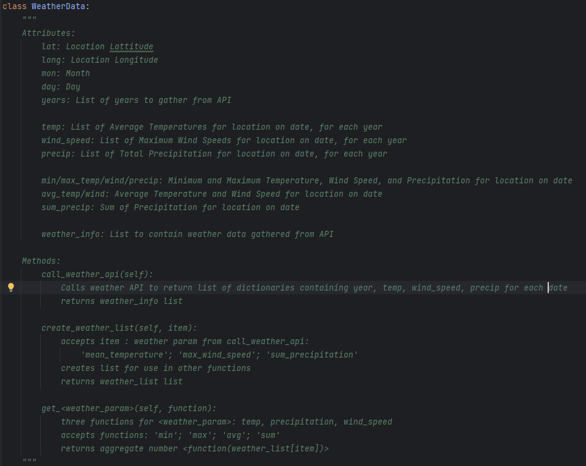
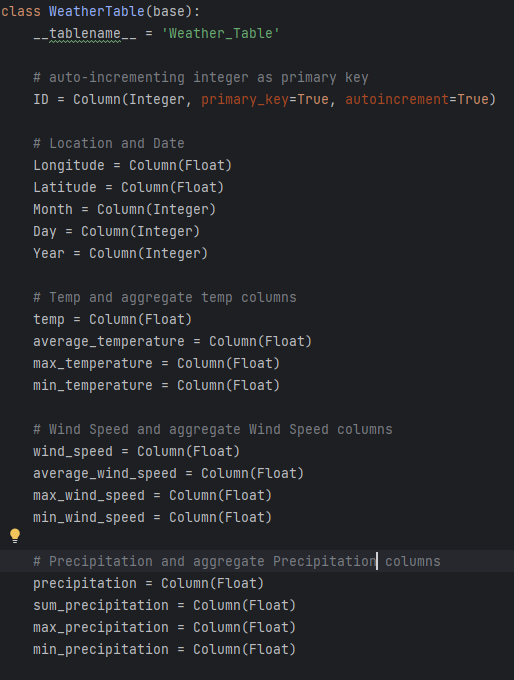
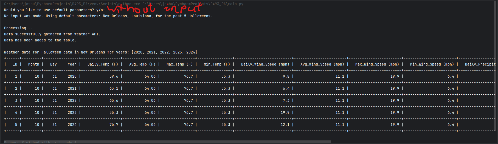

_If you are reading this in visual studio, images may not be displaying properly. The following link will direct you to 
a github repository, where the images should be displaying._

https://github.com/JoshuaMcClintic/JGN1_Python_Performance-Assessment/tree/v1.0.0

If you wish to run the program, download the test_zip folder, or just the .zip file in the test_zip folder, or the 
Weather_API_Program in the 'releases' section. Unzip the file, and run the main.py file. Make sure you have the proper
libraries installed before running.

# Scripting and Programming - Applications — D493 Performance Assessment JGN1

This is a performance assessment for class D493 at Western Governor's University. The task was to create a program to 
show weather data for a five-year period in a location of my choice using the API at 
https://open-meteo.com/en/docs/historical-weather-api. I chose to gather the data from the past 5 years on Halloween, 
as this project was done in October, for New Orleans, Louisiana. The python file, when run, accepts inputs for other 
locations and dates, but defaults to the above information. Feel free to check your own desired location, date, and 
number of years!

## Input
When the program is run, the user is prompted to use either default info or use unique info. Info is: latitude, 
longitude, month, day, number of years, the final year to check for data.

## Output
Outputs a table with weather info: temp, wind speed, precipitation for each year on set date.

## Libraries
The project uses the libraries 'requests', 'sqlalchemy', 'sqlite3', 'tabulate', and 'sys'. Two libraries were created 
for the project: 'weather_data' and 'database'.
## weather_data.py

This file contains the bulk of the code. It defines a class WeatherData with methods to access the weather API and 
aggregate weather information as MIN, MAX, AVG, or SUM.
##

## database.py
This file creates the class WeatherTable. It is a table created using sqlalchemy.

## 

## main.py
Once this file is run, you will be asked whether you would like to use the default values for variables or your own 
values. If Enter is pressed without any input typed, default values will be used. The default values are: 
latitude = 29.9547, longitude = -90.0751, month = 10, day = 31, years = [2020, 2021, 2022, 2023, 2024]. 
These values correlate to Halloween for the past 5 years in New Orleans, Louisiana.

####
Once the variables are decided, the program adds data from the weather API to a sqlite database, and queries the table. 

Finally, it prints the table to the python console with headers.

